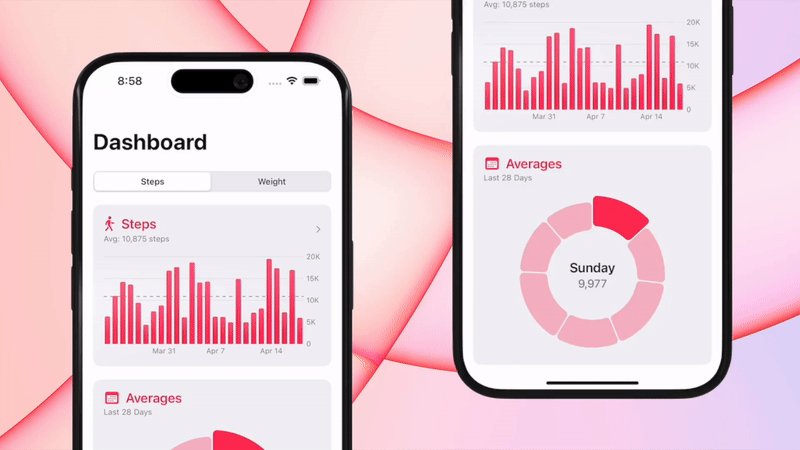
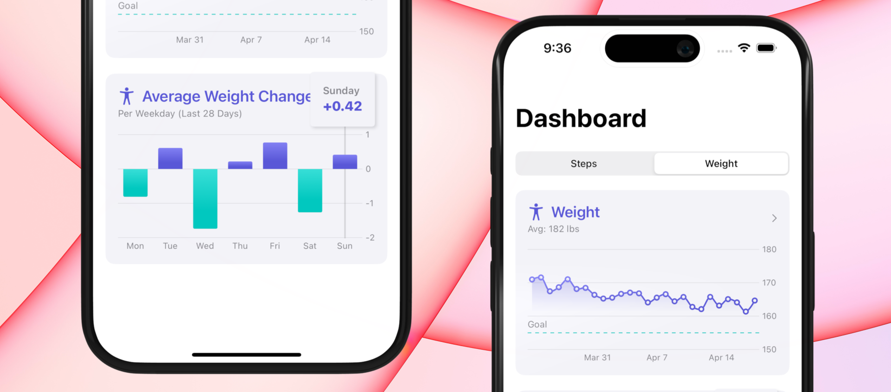

# Step Tracker
Step Tracker integrates Apple Health to show your latest step and weight data in animated, interactive Swift Charts. You can also see your average steps and weight gain/loss for each weekday for the past 28 days.

Step Tracker also allows you to upload new step or weight data to the Apple Health app.

# Technologies Used
* SwiftUI
* HealthKit
* Swift Charts
* Swift Algorithms
* DocC
* Git & GitHub
* Swift 6 Concurrency
* Swift Testing

# Animated Swift Charts


# I'm Most Proud Of...
The average weight difference per day of the week bar chart. Determining which day of the week were problem days for someone trying to lose weight struck me as a great insight to surface from the weight data. 

I pulled the last 29 days of weights and ran a calculation to track the differences between each weekday. I then averaged each weekday's gain/loss and displayed them in a bar chart and conditionally colored the positive and negative weight change values.

Here's the code:

```swift
    static func averageDiffFromPreviousDay(for weights: [HealthMetric]) -> [HealthMetric] {
        var diffValues: [(date: Date, value: Double)] = []

        for i in 0..<weights.count {
            if i == 0 {
                diffValues.append((weights[i].date, 0.0))
            } else {
                let date = weights[i].date
                let weightDiff = weights[i].value - weights[i - 1].value
                diffValues.append((date, weightDiff))
            }
        }

        let sortedByWeekday = diffValues.sorted { $0.date.weekdayInt > $1.date.weekdayInt }
        let weekdayArray = sortedByWeekday.chunked { $0.date.weekdayInt == $1.date.weekdayInt }

        var chartData: [HealthMetric] = []

        for array in weekdayArray {
            guard let firstValue = array.first else { continue }
            let valuesTotal = array.reduce(0) { $0 + $1.value }
            let averageValue = valuesTotal / Double(array.count)
            chartData.append(.init(value: averageValue, date: firstValue.date))
        }
        return chartData.sorted { $0.value > $1.value }
    }
```
<br>
</br>




# Completeness
Although it's a simple portfolio project, I've implemented the following
* Error handling & alerts
* Empty states
* Permission Priming
* Text input validation
* Basic unit tests
* Basic accessibility
* Privacy Manifest
* Code documentation (DocC)
* Project organization


## Credits

- This is Sean Allen's [Teachable Course](https://seanallen.teachable.com/courses/enrolled/2509363): "Portfolio Piece - SwiftUI, HealthKit, Charts - iOS 18".
